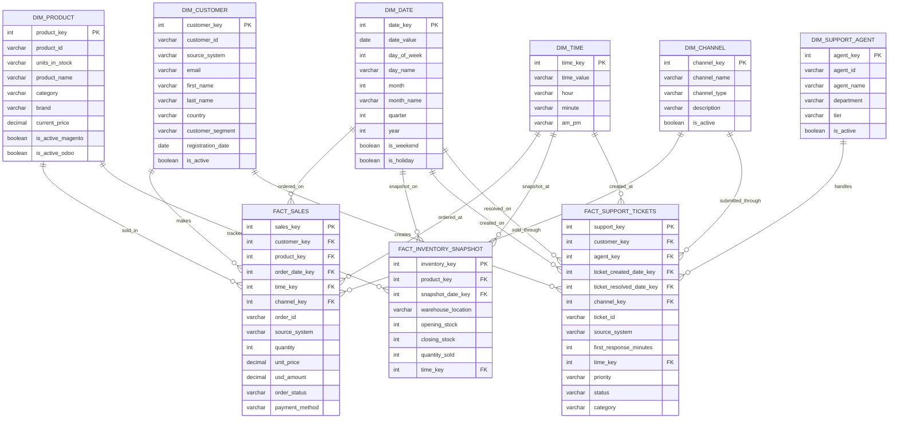

## Unified Data Warehouse - Galaxy  Schema Design Summary

This database is the centralized analytical system that consolidates data from multiple source systems (Magento, Odoo, Freshdesk) into a unified star schema for comprehensive business intelligence and reporting. It stores denormalized, dimensional data optimized for analytical queries and business intelligence with focus on performance and flexibility. Typical operations include cross-system analytics, historical trend analysis, customer journey tracking, and operational performance monitoring. It acts as the single source of truth for all business analytics and reporting across the organization.

- Primary entities: dim_date, dim_customer, dim_product, dim_channel, dim_support_agent, dim_time, fact_sales, fact_inventory_snapshot, fact_support_tickets.

- Workload profile: complex analytical queries; read-heavy operations; optimized for aggregations and reporting; denormalized star schema design.

- Use cases: business intelligence, cross-system analytics, customer 360 analysis, inventory optimization, support performance monitoring, executive dashboards, trend analysis.

# Granularity : 

### 1. FACT_SALES

Grain: One row per order item per order per day

- Primary Grain: Individual order item within a specific order on a specific date

- Business Meaning: Each record represents a single product sold in a specific order at a specific point in time

### 2. FACT_INVENTORY_SNAPSHOT

Grain: One row per product per warehouse per day

- Primary Grain: Daily inventory snapshot for each product in each warehouse location

- Business Meaning: Each record represents the inventory status of a specific product in a specific warehouse at the end of a specific day

### 3. FACT_SUPPORT_TICKETS

Grain: One row per support ticket

- Primary Grain: Individual support ticket with creation and resolution dates

- Business Meaning: Each record represents a single support ticket with its lifecycle from creation to resolution

### Grain Summary :

|Fact Table|Grain Level|Business Process|Primary Use Case|
|---|---|---|---|
|FACT_SALES|Order Item + Date|E-commerce Sales|Revenue analysis, product performance|
|FACT_INVENTORY_SNAPSHOT|Product + Warehouse + Date|Inventory Management|Stock optimization, demand forecasting|
|FACT_SUPPORT_TICKETS|Ticket + Customer + Agent|Customer Support|Service quality, agent performance|

# Schema : 

# Relationships:

- Cross-System Integration: Unified customer and product dimensions across all source systems

- Temporal Analysis: Comprehensive date and time dimensions for trend analysis

- Multi-Channel Support: Unified channel dimension for all customer touchpoints

# Business Logic:

- Unified Customer View: Single customer dimension consolidating data from Magento, Odoo, and Freshdesk

- Cross-System Analytics: Ability to analyze customer journey across sales, support, and business operations

- Inventory Optimization: Historical inventory tracking with sales correlation for demand forecasting

- Support Performance: Agent performance metrics with customer satisfaction correlation

- Revenue Analysis: Comprehensive sales analysis across all channels and time periods

- Operational Intelligence: Business process optimization through cross-system insights
