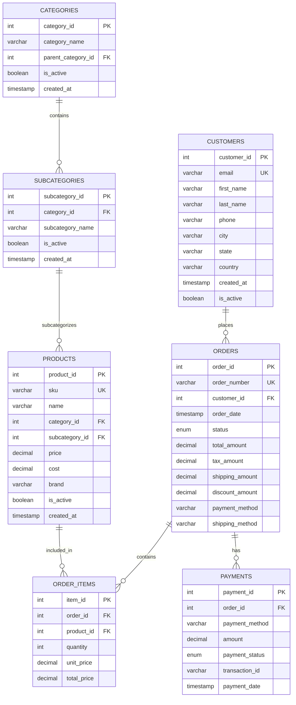
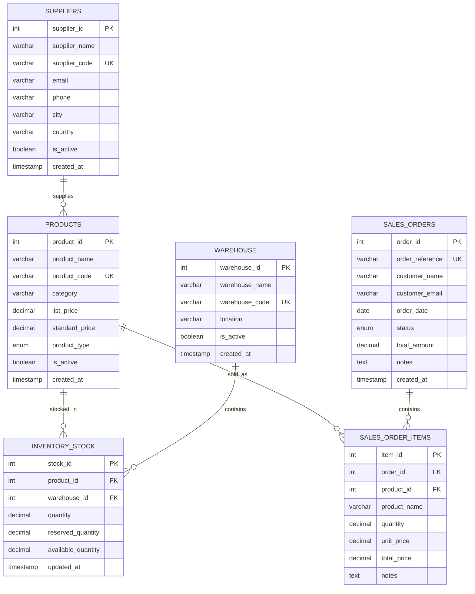
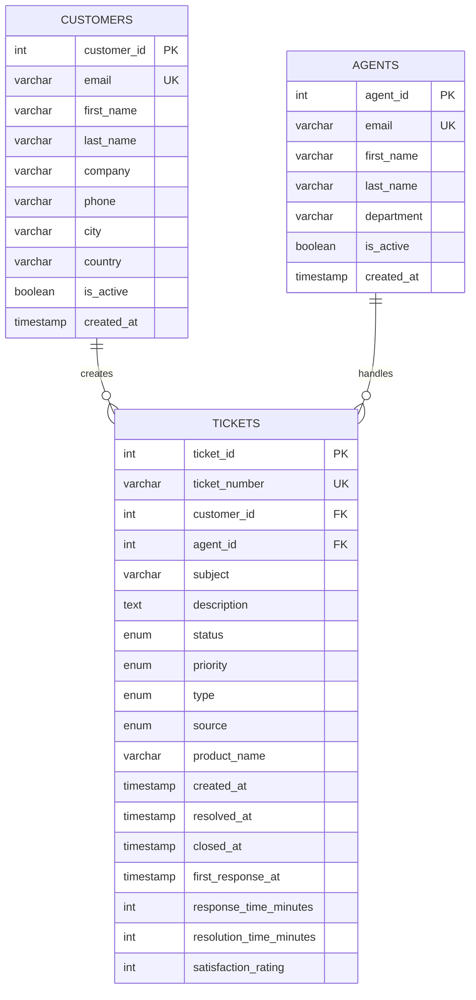

# 1.Magento Database

This database is the primary system for recording online sales transactions and customer interactions. It stores highly structured, relational data optimized for high-volume e-commerce operations with strict transactional guarantees. Typical transactions include customer registrations, product catalog management, order processing, payment processing, and inventory tracking. It acts as the single source of truth for all online sales records and customer data.

- Primary entities: Orders, Order_Items, Customers, Products, Categories, Subcategories, Payments.

- Workload profile: short, frequent transactions; high concurrency; ACID compliance; normalized schema optimized for e-commerce operations.

- Use cases: online order capture, payment processing, customer account management, product catalog management, order fulfillment tracking, customer analytics.

## Schema :

# 2.Odoo ERB Database

This database is the primary system for recording enterprise resource planning (ERP) operations and inventory management. It stores highly structured, relational data optimized for business process management with strict transactional guarantees. Typical transactions include product catalog management, supplier relationship management, inventory tracking, B2B sales order processing, and warehouse operations. It acts as the single source of truth for all business operations, inventory levels, and supplier relationships.

- Primary entities: Products, Suppliers, Warehouse, Inventory_Stock, Sales_Orders, Sales_Order_Items.

- Workload profile: medium to long-running transactions; moderate concurrency; ACID compliance; normalized schema optimized for business operations and inventory management.

- Use cases: product catalog management, supplier relationship management, inventory tracking, B2B sales order processing, warehouse operations, business analytics, cost management.

## Schema :

# Freshdesk customer support Database :

This database is the primary system for recording customer support operations and service interactions. It stores highly structured, relational data optimized for customer service management with strict transactional guarantees. Typical transactions include ticket creation, agent assignment, customer communication tracking, resolution management, and satisfaction monitoring. It acts as the single source of truth for all customer support interactions and service quality metrics.

- Primary entities: Customers, Agents, Tickets.

- Workload profile: short to medium transactions; moderate concurrency; ACID compliance; normalized schema optimized for customer service operations and performance tracking.

- Use cases: ticket management, customer service tracking, agent performance monitoring, satisfaction measurement, support analytics, service quality management.

## Schema :

